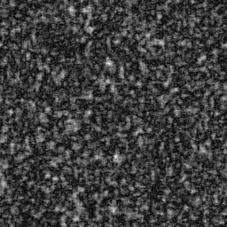
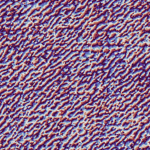
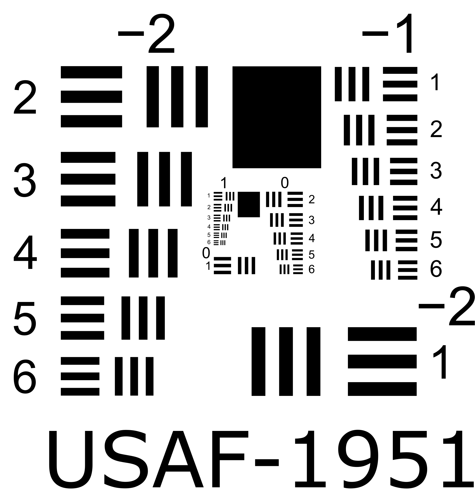
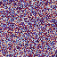
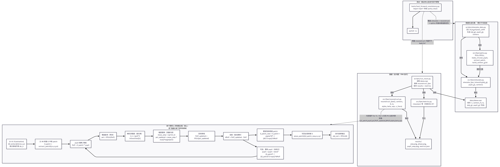

# FPM-classic

A minimal, reproducible implementation of **classic Fourier Ptychographic Microscopy (FPM)**:
- forward simulation (multi-illumination intensity stack)
- iterative reconstruction (object update; optional pupil recovery)
- basic tests for sanity & maintainability


## Quickstart

```bash
pip install -r requirements.txt

# simulate (USAF)
python scripts/simulate_data.py --out data/usaf_base.npz --phantom usaf --seed 0

# reconstruct
python scripts/run_recon.py --in data/usaf_base.npz --out runs/quickstart_usaf --n-iters 6
```

## Demo results

Amplitude | Phase | USAF-1951
:--:|:--:|:--:
 |  | 


(Optional) Pupil amplitude | Pupil phase
:--:|:--:
 | 

## Project structure

- `src/fpm/` : core library (optics utils, forward model, reconstruction)
- `scripts/` : runnable entry points (simulate data / run reconstruction)
- `tests/` : minimal sanity tests (`pytest`)

## Setup (Windows / PowerShell)

Clone the repository:

```powershell
git clone https://github.com/pj-sun-optics/FPM-classic.git
cd FPM-classic
```


## Physical Process  （物理过程）


